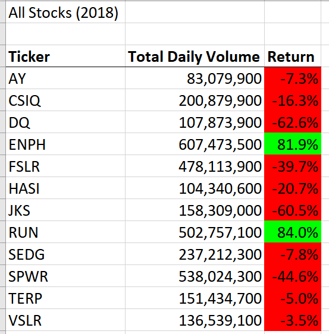
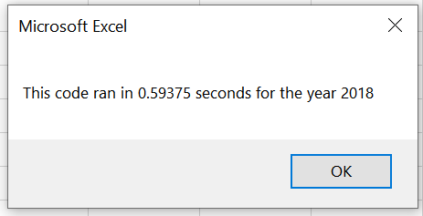
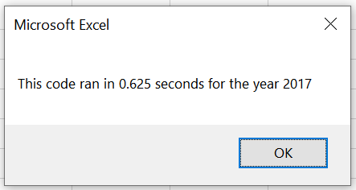

# VBA-analysis

## Overview
  The reason our client, Steve, hired us was to analyze green energy stocks for his parents investment portfolio. Steves's parents wish to invest fully in one single stock, but Steve believes diversifying would be more beneficial. So, he hired us to analyze some green stock history and find out which stocks would be the "best" option for his parents portfoilio.  We were tasked with using VBA to write some code in order to pull relevant data from the data sheets our client provided us. The main purpose of this assignment was to teach us the language and syntax of VBA, specifically as it pertains to Microsoft Excel. 

## Results
  After the analysis, the results show that stocks are stocks, meaning that the prices and stability of each stock is very unstable and volatile. In 2017, almost every stock had a positive return with a range from 5 percent to almost 200 percent. There was also little to no correlation between the total volume and the return.

  The results for 2018 showed almost the exact opposite with almost every stock posting a negative return on the year, again with no correlation between total volume and end of year return. Additionally the stock that posted the highest return for 2017 at 199 percent, DAQO, posted the worst return of 2018 with negative 62 percent. So, given the results of this analysis, I cannot confidently give Steve and answer as to which stocks would be the best for his parents to invest in.

  However, I would also suggest to Steve that if he would like more in depth and conclusive analysis to analyze stock data of these companies for at least the last ten years. Then you would better be able to see any trends and also be able to create pivot tables off the data in order to better visualize the history of each stock. This would allow the best chance of finding worthwhile investments and give Steve's parents more solid data to explain why each stock was chosen.

## Summary
  I don't know much about coding (yet, hopefully), but a couple of things I have heard are that you're going to be reading more code than you write, and that refactoring is one of the most crucial programming skills to have. I recently watched a video in which a person wrote a piece of code that took almost a month to complete. In the video he explains that he reached out to subscribers to see if they could help, and they ended up lowering that time down to under a second after a couple of weeks. While that may be an extreme example, It shows how important clean and efficient code is to your computer and your time.

As far as the time save for our project I only noticed about a 5 millisecond decrease in the total time it took for my code to run on each year. 

 

Both of the screenshots are form the refactored code, but curiously the analysis for 2017 took a bit longer. The only bit of refactoring I could think to do before I started the challenge was to get rid of the yearValue module and just put the input box and initialization of the yearValue variable in the AllStocksAnalysis module. In the end that is exactly what the refactoring assignment did, so that is an encouraging sign.
